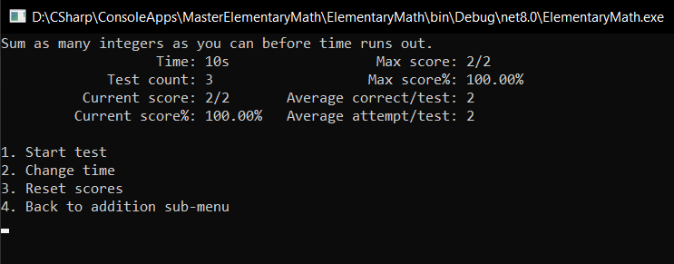

# MasterElementaryMath
Console app to practice elmentary operations like addition. All you have to do is solve as many questions as you can within the set time. And check your score.



## Known issues
- The timer shows the total time you'll get and it doesn't countdown because I am too dumb to implement that. And after running out of time it doesn't close immediately but waits for last user input, which enables you to have infinite time for your last attempt.
- Currently only do addition of two random 2-digit +ve integers.

## Latest Release info:
| OS | size (in MB) | SHA 256 |
| :---: | :---: | :---: |
| [win_x64](https://github.com/Tankit927/MasterElementaryMath/releases/download/0.1/MasterElementaryMath_win.zip) | 0.06 | 7E01E93F818B6659D297E1C92C09ACE8D0FC61AEA8E417CACC1929D241B661F2 |
| [win_x64_self_contained](https://github.com/Tankit927/MasterElementaryMath/releases/download/0.1/MasterElementaryMath_win_self_contained.zip) | 31.7 | 6F5050611AAD63ACD06D00E9199C722C3718DAA85E6752CAB30F0222F87B9B13 |
| [linux_x64](https://github.com/Tankit927/MasterElementaryMath/releases/download/0.1/ElementaryMath_linux.zip) | 0.03 | A016FC2B1712B8105E30D1BDF86C22F883CBAFE20A6336536811B31358A8A421 |
| [linux_x64_self_contained](https://github.com/Tankit927/MasterElementaryMath/releases/download/0.1/ElementaryMath_linux_self_contained.zip) | 31 | 88E4C7DAECDAC31956806070F13CCA9CA99EB9B384991243FE29611199C53CFD |

## Note
- .NET 8.0 Runtime need to be installed on the system and its path should be set in environment variables to run non-self contained version *(recommended)*.
- You can also run console app using `dotnet MasterElementaryMath.dll`.
- Or download and run the self-contained file which has .NET 8.0 Runtime included in it.

## Prerequisite to run non-self contained version
- To check if dotnet runtime is already present.
  ```
  D:\CSharp\ConsoleApps\MasterElementaryMath>dotnet --list-runtimes
  Microsoft.AspNetCore.App 8.0.7 [C:\Program Files\dotnet\shared\Microsoft.AspNetCore.App]
  Microsoft.NETCore.App 8.0.7 [C:\Program Files\dotnet\shared\Microsoft.NETCore.App]
  Microsoft.WindowsDesktop.App 8.0.7 [C:\Program Files\dotnet\shared\Microsoft.WindowsDesktop.App]
  ```
- You only need this one
  ```
  Microsoft.NETCore.App 8.0.7 [C:\Program Files\dotnet\shared\Microsoft.NETCore.App]
  ```
- Download and install [.NET 8.0 Runtime](https://dotnet.microsoft.com/en-us/download) if not already present.
- Add its path in environment variables.
    - For Windows 10 & above:
         - Type *environment variables* in search bar.
         - Advanced -> Environment Variables
         - Edit System Variables -> Path
         - New -> paste the path. For me it is `C:\Programs Files\dotnet\`
    - For linux *(debian 12)*
         - Add path in appropriate configuration file.
         - I personally have to add path in `/etc/profile` like this.
           ```
           PATH=/directory_where_I_have_downloaded_dotnet:some_other_path:more_other_paths
           ```
